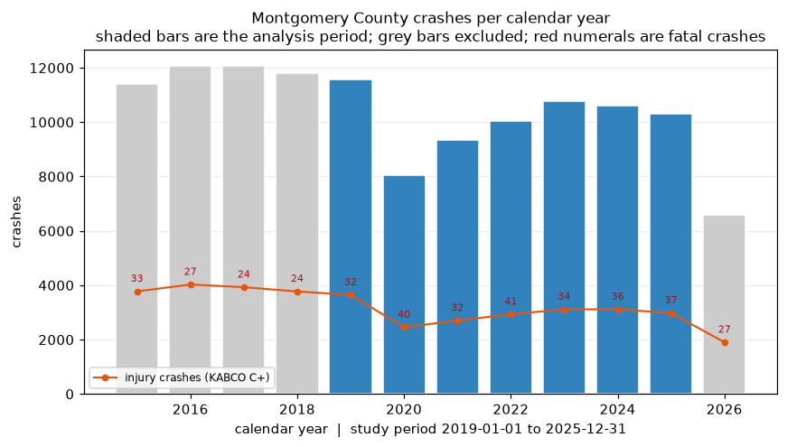
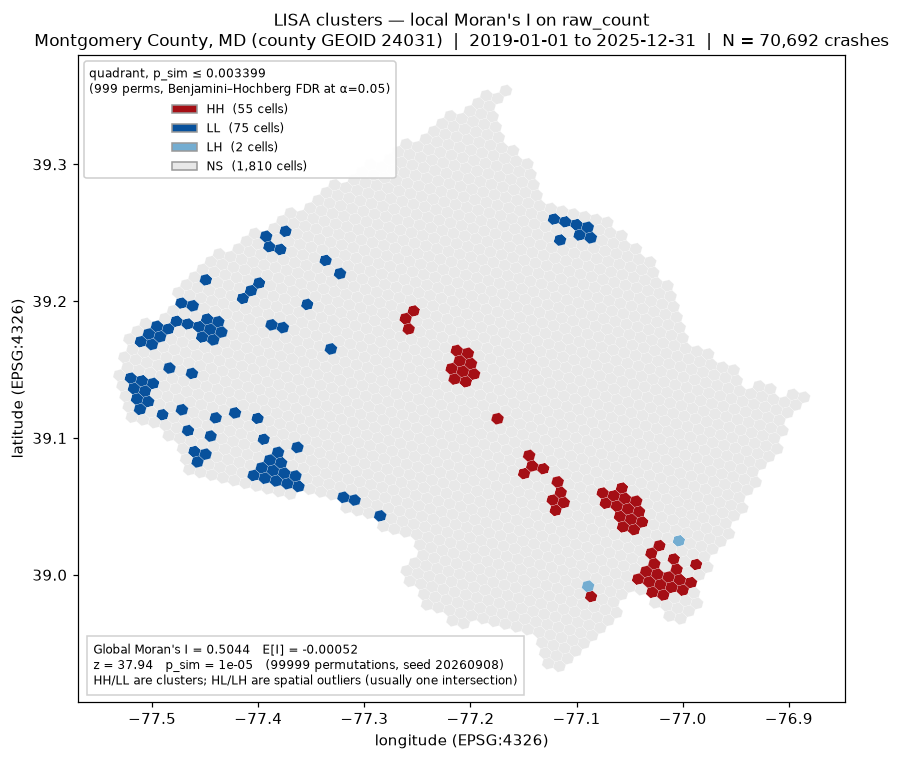
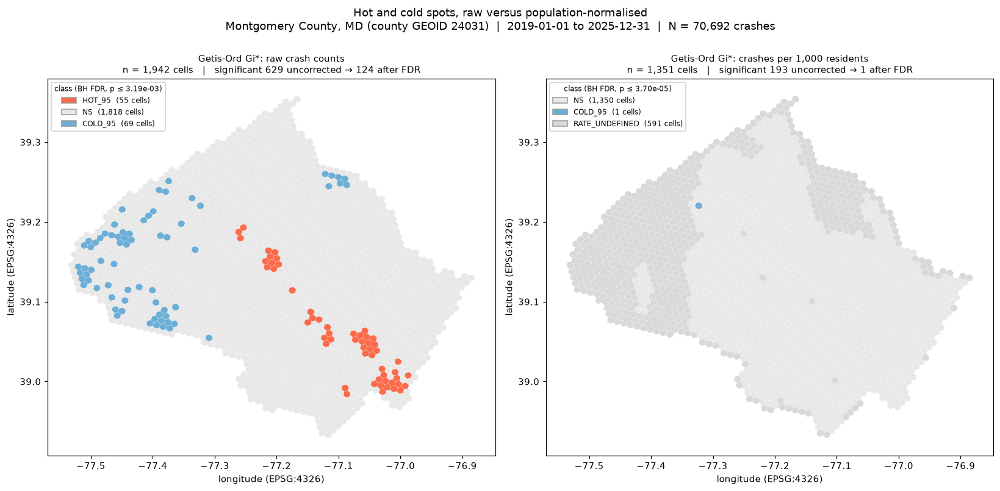
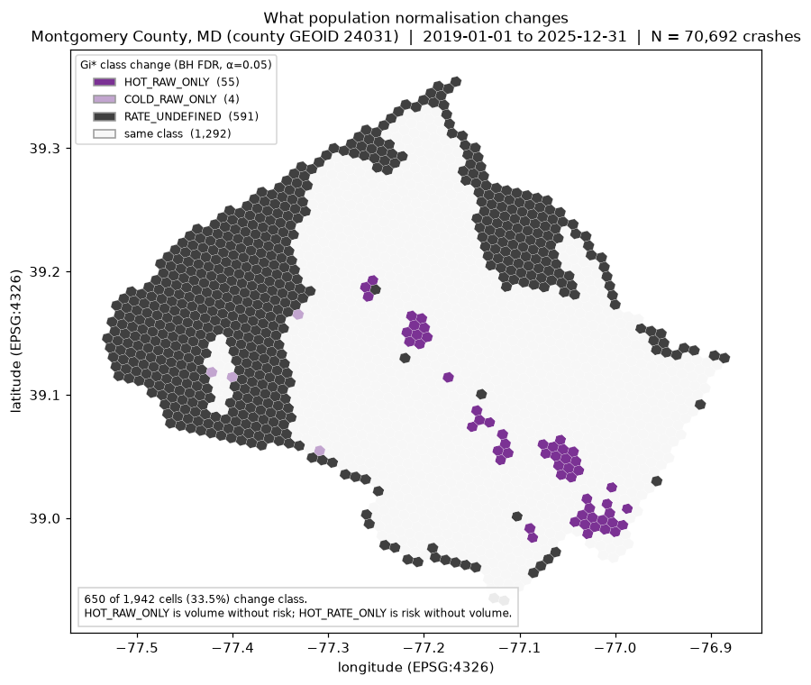
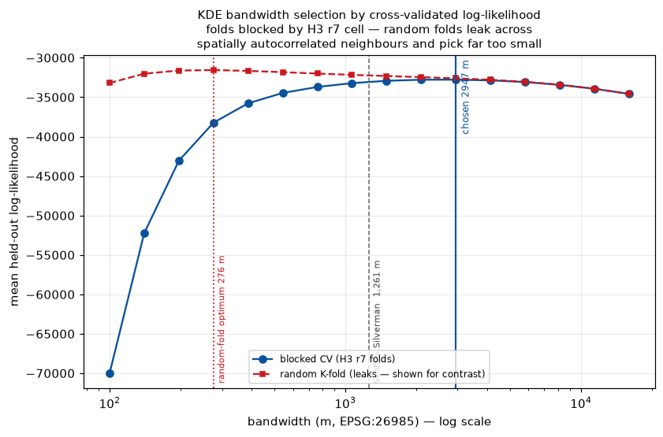
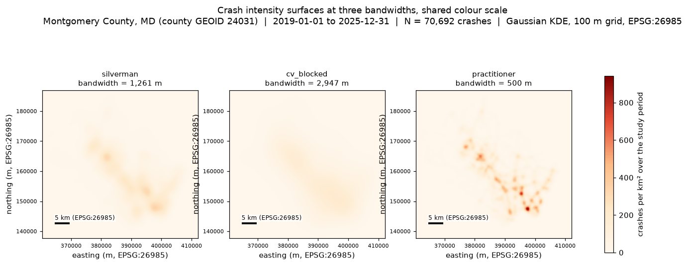
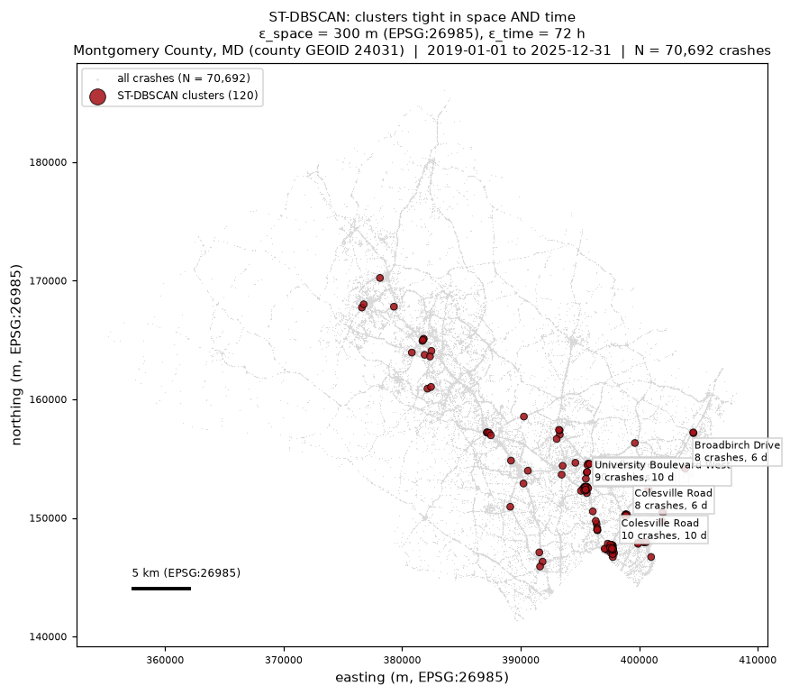

# Spatial analysis — Montgomery County, MD

Four analyses over the Phase 4 enrichment: global and local Moran's I,
Getis-Ord Gi\* with a Benjamini–Hochberg correction, kernel density with a
cross-validated bandwidth, and ST-DBSCAN over space *and* time. Reproduced by:

```
python -m src.transform.model && python -m src.geo.build && python -m src.analysis.build
```

Every number here is a field in `data/gold/analysis/_analysis_manifest.json`.
Code in `src/analysis/`, thresholds in `config/geo.toml [analysis]`, outputs
validated against `contracts/analysis.schema.json` before the first write.

---

## 1. Study area, period, and what was excluded

**The study area is a polygon answer, not a jurisdiction label.** Montgomery
County is `pip_county_geoid = '24031'` — where the coordinate actually fell,
per the Phase 4 point-in-polygon join — not `jurisdiction = 'MD'`, which is
where the report was *filed*. Montgomery police file crashes outside the
county, and those rows have no Montgomery population denominator.

| | rows |
|---|---:|
| Montgomery feed, all years | 125,005 |
| — no usable coordinate | 105 |
| — outside county 24031 by polygon | 288 |
| — outside 2019-01-01 … 2025-12-31 | 53,920 |
| **study corpus** | **70,692** |

The 288 are itemised because *which* county matters: Prince George's 162,
District of Columbia 46, Fairfax VA 32, Frederick 29, Howard 17, Carroll 1,
Arlington VA 1. A `jurisdiction = 'MD'` filter would have kept 241 of them and
put Washington DC hot spots in a Maryland analysis. A further 49 in-county
crashes were dropped as FARS-primary: FARS is a fatal-only census over
2019–2024 against an all-severity feed over 2015–2026, and mixing regimes makes
a rate mean two things for 0.04% more rows.

**Period 2019–2025, complete calendar years.** 2026 ends 2026-09-02, and a
partial year in a per-cell count is a statistic about the calendar. The 2020
drop — 8,066 against an ~11,500 baseline — is a real exposure change, not a
safety improvement; keeping 2019 puts it inside the window rather than at its
edge, where it would read as a trend. 2015–2018 run as `--sensitivity`.



**The cell universe is the filled county, not the cells that had crashes.**
Filling the county polygon with H3 r8 cells in *overlap* mode gives **1,942
cells**; 1,705 are wholly inside, 237 straddle the line. 1,402 have crashes and
**540 have none** — and all 540 are in every test. A hot-spot test run only
over non-zero cells conditions on the outcome: it cannot find a cold spot, and
cannot see the zero that makes its neighbour hot.

**Population is apportioned, and 591 cells have no usable denominator.** Block
groups and hexagons do not nest, so a cell's population is the area-weighted
share of every block group it intersects, all areas computed in **EPSG:5070**
— equal-area, because the apportionment is a *ratio of areas* and only an
equal-area projection makes that ratio the number the Census would compute. The
allocation is mass-preserving to exactly 0.0 relative error, asserted every
build. 591 cells fall under the 50-resident floor and get no per-capita rate;
**228 of them contain crashes**. Those are the interchanges, the airport, the
parkland and the Agricultural Reserve, and Section 3 is about them.

**Texas was not analysed, and the reason is arithmetic.** The TxDOT slice is
OIDs 1–100,000 of 3,088,450; 92,703 geocode, across all 254 counties,
2020–2024. That looks statewide and the county mix tracks population — but the
selection rule behind the OID range is undocumented, and those crashes land in
29,832 r8 cells at **3.1 per cell**. Filling the Texas polygon at r8 gives
~950,000 cells averaging 0.1 crashes. A Gi\* over that tests the OID assignment
at least as much as the crash process.

---

## 2. Does clustering exist at all?

The global test first, because everything below assumes the answer is yes.
`esda.Moran`, 99,999 conditional permutations, seed 20260908, row-standardised
k=1 hex contiguity.

| variable | n | Moran's I | E[I] | z | p (permutation) |
|---|---:|---:|---:|---:|---:|
| raw crash count | 1,942 | **0.5044** | −0.00052 | 37.94 | < 1e-05 |
| crashes per 1,000 residents | 1,351 | **0.1890** | −0.00074 | 11.80 | < 1e-05 |

**Yes on both, by very different amounts.** Crash *volume* is strongly
clustered (I = 0.50), which is close to uninformative on its own — volume
clusters wherever roads and people are. Crash *risk* also rejects the null, but
at I = 0.19, roughly a third as much. That gap is the finding that drives
Section 3. Both p-values sit at the floor 99,999 permutations can produce, so
read them as "below 1e-05".

---

## 3. Where, and what normalisation changes

Local Moran's I decomposes the global statistic per cell; Gi\* asks the
operational question, "is the amount of crash in this neighbourhood unusually
large". Both at 99,999 permutations, Benjamini–Hochberg corrected.

| | LISA sig. (uncorr. → BH) | Gi\* sig. (uncorr. → BH) | HOT_95 | COLD_95 |
|---|---:|---:|---:|---:|
| raw crash count | 637 → **132** | 629 → **124** | 55 | 69 |
| crashes per 1,000 residents | 193 → **1** | 193 → **1** | **0** | 1 |

At 1,942 tests and α = 0.05, ~97 cells are expected significant under a true
null — the same order as the number this map actually has. An uncorrected map
is not evidence; it is a map with about a hundred lies on it in unknown places.
The correction removes 505 of the 637 raw-count LISA cells.



**The 55 HH cells name themselves.** By modal snapped road: **Georgia Avenue**
(8 cells), **Veirs Mill Road**, **University Boulevard West** and **Rockville
Pike** (3 each), then Randolph Road, East-West Highway, Colesville Road, Flower
Avenue, Twinbrook Parkway, Piney Branch Road and Montgomery Village Avenue.
Multi-lane arterials through the Rockville–Wheaton–Silver Spring crescent.

**The 75 LL cells are the Agricultural Reserve, and 58 have no road name at
all** — no crash in them snapped to a named road. The 17 that do are rural
upcounty: River Road, Martinsburg Road, Whites Ferry Road, Edwards Ferry Road,
Elmer School Road, Damascus Road. A zoning-protected farm belt, in a crash
table.

**Only 2 spatial outliers, both LH.** No hot island in a cold neighbourhood at
this grain. That is a MAUP consequence, not an absence of bad intersections: at
r8 (~0.74 km²) a single bad junction is averaged into its surroundings.



### Normalisation does not change the answer. It erases it.

Every one of the 55 raw-count hot cells is non-significant per capita, and *no*
cell becomes hot under normalisation. The `hotspot_contrast` table has 650
rows: 591 `RATE_UNDEFINED` (no denominator), 55 `HOT_RAW_ONLY`, 4
`COLD_RAW_ONLY`, and **0 `HOT_RATE_ONLY`**. The one cell surviving correction
per capita is `882aaa9647fffff` on West Old Baltimore Road — one crash, 145
residents — and it is **cold**.

| road (modal snap) | crashes | injury | fatal | residents | per 1,000 |
|---|---:|---:|---:|---:|---:|
| Georgia Avenue | 903 | 254 | 2 | 3,687 | 245 |
| Georgia Avenue | 879 | 236 | 1 | 8,936 | 98 |
| Fenton Street, Silver Spring | 476 | 101 | 0 | 3,518 | 135 |
| Colesville Road | 442 | 94 | 0 | 3,191 | 139 |
| North Frederick Avenue | 437 | 146 | 0 | 680 | **643** |
| University Boulevard East | 360 | 80 | 4 | 2,963 | 121 |
| Quince Orchard Road | 193 | 53 | 1 | 400 | **483** |

The last column is the mechanism. Per-capita rates in the hottest cells vary
eightfold, 83 to 643 per 1,000, and the cells with the highest rates have the
fewest residents. **Residential population is the wrong denominator for crash
risk on an arterial**: North Frederick Avenue's crashes are generated by people
who live elsewhere. Population per hexagon answers "how dangerous is it to
*live* here"; every one of these cells is dangerous to *drive through*. The
right exposure measure is vehicle-miles travelled, which no public feed in this
exercise provides.



**Why the business should care.** A raw-count map ranks Silver Spring and
Georgia Avenue first, and it is right — for the same reason a map of anything
ranks downtown first. Prioritising outbound contact by crash density therefore
concentrates contact on the densest tracts, which in this county are also the
lowest-income. The fix is not to adjust with an ACS variable: using block-group
income or its proxies to rank *who gets called* is the redlining-adjacent
design ASSIGNMENT.md Part 4 warns about, and this pipeline never loads those
variables. Population (`B01003_001E`) is the only ACS field fetched at all, and
it is used as a denominator in aggregate, never as a per-record attribute.

### The permutation budget changed this answer

At the conventional 999 permutations the per-capita map came back **empty after
correction** — an artefact, not a finding. A permutation p cannot go below
1/(m+1); BH rejects at rank *k* only when p₍ₖ₎ ≤ kα/n; so rejecting even the
strongest cell needs m+1 ≥ n/α = 38,840. Below that the test has run out of
*resolution*, not evidence, and `esda.fdr` returns α/n — indistinguishable from
a genuine strict result.

| permutations | Gi\* raw, after BH | Gi\* per-capita, after BH |
|---:|---:|---:|
| 999 | 0 | 0 |
| 9,999 | 63 | 0 |
| **99,999** | **124** | **1** |

`src/analysis/correction.py` recomputes the BH decision independently so the
build can tell "rejected nothing" from "rejected exactly one", and warns when a
run was resolution-limited. That empty map was the most dangerous number this
phase could have published.

---

## 4. Intensity surface: bandwidth selection is the exercise

Gaussian KDE on a 100 m grid in **EPSG:26985** (NAD83 / Maryland, metres).

| method | bandwidth | basis |
|---|---:|---|
| Scott / Silverman | 1,261 m | closed form; identical in 2-D, where Silverman's (n(d+2)/4) factor is n |
| practitioner control | 500 m | what gets picked off the shelf |
| **cross-validated, spatially blocked** | **2,947 m** | max held-out log-likelihood, H3 r7 folds |
| *random-fold CV (leaks)* | *276 m* | *shown as the warning* |



**The blocked folds are the point.** A randomly held-out crash almost always
has a training crash tens of metres away, often at the same junction, so a tiny
bandwidth scores brilliantly by having memorised it. Random 5-fold CV picks
**276 m**. Blocking folds by H3 r7 (~5.2 km²) holds out a whole neighbourhood,
and the answer moves to **2,947 m** — **10.7× larger**. That is the leak
ASSIGNMENT.md's spatial-cross-validation row describes, measured here, and it
bites a density estimate as hard as it bites a model.



One shared colour scale, because rescaling each panel would make them all look
equally peaked and hide the only thing the figure is for. At **500 m** the
surface peaks at 942 crashes/km² and resolves individual junctions — the most
detailed and least stable. At **1,261 m** it peaks at 342 and shows corridors.
At **2,947 m** it peaks at 191 and shows the county's development gradient,
which is close to a map of where people live.

**Which one goes in front of an operations team? The 1,261 m surface — not the
cross-validated one.** CV optimises held-out *likelihood*, which is not the
same objective as usefulness for dispatch; at 2,947 m the surface no longer
distinguishes one corridor from the next, and nobody needs a map to know
down-county is busier than the Reserve. The value of the CV number is that it
*bounds* how much of the 500 m detail is real: structure finer than about a
kilometre does not generalise across neighbourhoods, so the 500 m map may
locate sites *within* an already-identified corridor but must never rank
corridors against each other.

Each surface integrates to 1.0000 over its grid, which checks the extent and
the area units at once.

---

## 5. ST-DBSCAN: tight in space *and* time

Two independent thresholds — 300 m in EPSG:26985 and 72 hours, `min_samples` 5.
Space and time have no exchange rate, so `sklearn.DBSCAN`'s single metric
cannot express this; the neighbourhood is built as a sparse graph true only
where both conditions hold.

| run | clusters | crashes clustered | median size | **median span** |
|---|---:|---:|---:|---:|
| space **and** time | 120 | 677 | 5 | **4.0 days** |
| space only (same 300 m) | 168 | 69,508 | 9 | **2,199.5 days** |

A ratio of **550×**, and that contrast is the result. The same spatial epsilon
without the time condition sweeps 98% of all crashes into 168 blobs — the
largest holding **66,900** of 70,692 — each spanning six years. That is the
year-long smear: a map of the road network, drawable without the data.



The largest genuine bursts: 12 crashes on **Georgia Avenue** within 326 m over
9 days; 10 on **Colesville Road** over 10 days; 10 on **Ennalls Avenue** in
Wheaton over 8 days, 60% at night; 9 on **University Boulevard West** over 10
days; 8 on **Rockville Pike** over 6 days. The shape of a work zone, a failed
signal, or a storm week — things an operations team can check.

**What this does not find is a "recurring Friday-night corridor".** ST-DBSCAN
over *linear* time finds bursts, not recurrence: two crashes on consecutive
Fridays are 168 hours apart, and no ε_time links them without linking the whole
intervening week. The clusters confirm it — the modal weekday holds 17–43% of
each cluster, against 14% for no pattern at all. Weekly recurrence needs a
*cyclic* time coordinate or a per-cell day-of-week profile. That is a different
method, and it is named rather than relabelled.

Thresholds came from a measured sweep, not taste: the first attempt
(300 m / 6 h / 10) returned **zero** clusters, because ten crashes within 300 m
and six hours is a pile-up, not a pattern. The sweep is in `config/geo.toml`.

---

## 6. Limitations

- **MAUP.** r8 is one choice: coarse enough to average a bad junction into its
  surroundings (hence only two spatial outliers), fine enough that 591 cells
  have no usable population. A block-group-grain analysis, where population is
  native rather than apportioned, would give different and equally defensible
  numbers.
- **Edge effects.** 237 of 1,942 cells straddle the county line; their crash
  counts are truncated by the boundary while their population is not, biasing
  them **cold**. Flagged `is_edge_cell` and kept, because dropping them moves
  the bias to their neighbours.
- **A disconnected graph, for the rate only.** The raw-count weights matrix is
  one connected component with no islands. Dropping the 591 denominator-less
  cells splits the remaining 1,351 into **two** — the Reserve's unpopulated
  cells were the bridge to the upcounty settlements. The per-capita statistic
  is computed on a graph that is really two graphs: a property of the filter,
  not of the crashes, and another reason that map is weaker.
- **Population uniformity.** The apportionment spreads a block group's
  residents evenly, including across the half of it that is Rock Creek Park,
  giving park cells a plausible denominator and an understated rate.
- **Coordinate precision.** Officer-reported positions are good to tens of
  metres and worst where geocoded to a block centroid — which is why r9 was not
  used as the analysis grain.
- **The pandemic year** sits inside the window at 30% below baseline. Seven-year
  totals dilute rather than distort it, but a cell whose land use changed in
  2020 is described by an average over two regimes.

---

## 7. What this means for Phase 7

1. **Aggregate crash density is a legitimate context feature.** A cell-level
   count or KDE intensity joined by H3 cell describes the *road*, not the
   person, and carries provenance to a public crash count.
2. **ACS population is a denominator, not a feature.** It may normalise an
   aggregate; it must never become a per-record attribute. Income, tenure,
   vehicles and commute are not loaded at all — a stronger guarantee than a
   policy document.
3. **Backtest splits must be spatially blocked.** Section 4 measured what
   random folds do: a 10.7× error, always in the direction of "the model is
   better than it is". Block by H3 r7 or by county, and report the blocked
   score as *the* score, not as a robustness check beside a flattering one.
4. **Do not rank leads by neighbourhood crash density.** A raw-count hot-spot
   ranking is an exposure ranking, and in this county exposure correlates with
   the demographics Part 4 puts off limits.

---

*Montgomery County MD (GEOID 24031) · 2019-01-01 to 2025-12-31 · N = 70,692 ·
1,942 H3 r8 cells · 99,999 permutations · seed 20260908 · Benjamini–Hochberg at
α = 0.05 · storage EPSG:4326, areas EPSG:5070, distances EPSG:26985.*
