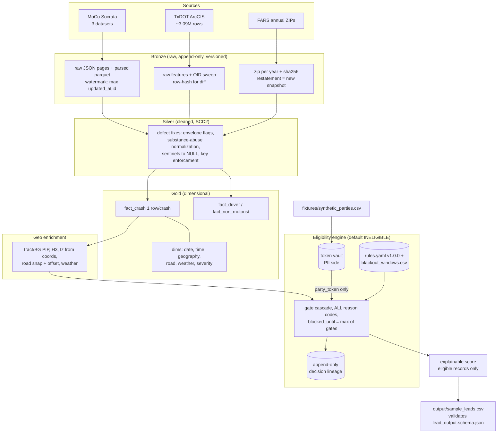
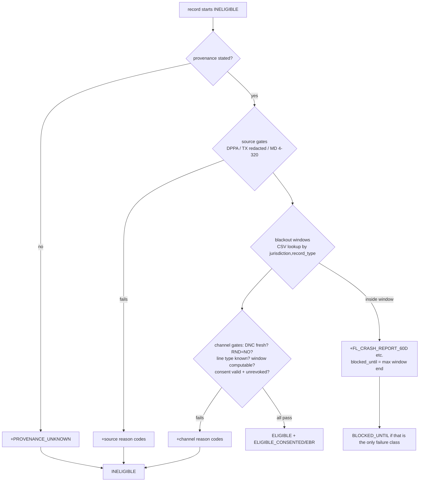

# Implementation Guide — "Crash-to-Contact" Take-Home

> A practical roadmap for implementing `ASSIGNMENT.md`. Read alongside the scaffold
> (`README.md`, `src/`, `config/`, `contracts/`, `fixtures/`, `tests/`).
>
> **Note before you start:** this file is an AI-assisted planning artifact. Since the
> assignment requires an honest `AI_USE.md` and grades the commit history, either keep
> this file out of the repo (gitignore it) or disclose it explicitly in `AI_USE.md`.

---

## 1. Assignment Overview

**What you are building:** a daily pipeline that ingests motor-vehicle crash data from
three public sources, models it dimensionally, enriches it geospatially, scores leads,
and — critically — attaches a **defensible, cited, auditable contact-eligibility
decision to every record** before anything reaches an outbound contact center.

**The real objective (read this twice):** the engineering is the *vehicle*; the
compliance judgment is the *test*. The assignment says so explicitly:

- Part 5 (the compliance gate) "decides the outcome" and carries a **hard cap**: a
  submission that emits contactable records without a per-record eligibility decision
  fails regardless of engineering quality.
- The expected honest conclusion is largely negative: the public sources are redacted
  **by statutory design** (no names, no phones), DPPA forecloses solicitation use,
  Maryland §4-320 bars telephone-solicitation use outright, Texas §38.12 criminalizes
  telephone solicitation as barratry, and attorney-conduct rules bar live telephone
  solicitation everywhere in scope. *"Zero deliverable leads for jurisdiction X, with
  citations"* is a **passing answer**; quietly producing lead counts is a failing one.
- The synthetic fixture (`fixtures/synthetic_parties.csv`) exists precisely because no
  production identity join exists. It lets you exercise the contact-channel machinery
  (tokenization, DNC, RND, line type, calling windows, consent) without real PII. Your
  memo must state that this join does not exist in production.

**Scoring shape (stated or implied):** compliance ≈ 25% with hard cap, geospatial is
the heaviest technical section, memo = 10%, process (commits, `DECISIONS.md`,
`AI_USE.md`) is graded, and there's a 60-minute live defense of your own code.

**Effort calibration:** 10–16 hours for a strong submission. Scope cuts are graded
*answers*, not apologies — cut deliberately and write it down.

**Hard constraints:**

- No scraping behind logins/paywalls/CAPTCHAs/ToS walls; document walls instead.
- No real third-party PII anywhere — automatic fail. Fixture values only in
  `output/sample_leads.csv` (≤100 rows).
- Don't modify `contracts/lead_output.schema.json` without explanation, and don't
  modify the fixture at all.
- Commit as you work; single-commit dumps are penalized.
- EPSG:3857 for any distance/buffer/area computation ⇒ that section scores zero.
- `UNION ALL` of CRSS with anything ⇒ found and penalized (easiest fix: don't use CRSS).

---

## 2. Requirements Breakdown

### 2.1 Functional requirements

**Ingestion (Part 1)** — all three sources, bronze layer preserving raw bytes:

| # | Requirement | Source |
|---|---|---|
| F1 | Incremental ingestion with durable watermark; re-runs don't duplicate; picks up late-arriving records for already-loaded dates | MoCo Socrata |
| F2 | Deterministic pagination (`$order` with `$offset`, or keyset) — graders check specifically | MoCo Socrata |
| F3 | Byte-for-byte raw payload in bronze alongside parsed form | All |
| F4 | Correct ArcGIS pagination over ~3.09M rows at 2,000/page; must survive a moving table and avoid server-side timeouts from unindexed WHERE clauses | TxDOT |
| F5 | Memo answer on whether the mislabeled TxDOT layer should be used at all | TxDOT |
| F6 | Full-refresh design tolerant of silent in-place restatement of prior years | FARS |
| F7 | Detect, document, and handle all nine "known defects" (see §6 below); `DATA_QUALITY.md` reports each with detection method | All |

**Modeling (Part 2):**

| # | Requirement |
|---|---|
| F8 | Crash-level fact: exactly one row per crash, documented natural key + stable surrogate key |
| F9 | Party-level facts (driver, non-motorist) at their own grain, related correctly |
| F10 | Conformed dimensions: date, time, geography, road class, weather condition, severity |
| F11 | Cross-source entity resolution — or a *proof* (not assertion) that the universes are disjoint enough to scope instead |
| F12 | Severity crosswalk to a single ordinal (contract: integer 0–5), with lossiness documented |
| F13 | Restatement strategy (SCD2 / snapshot / event-sourced) with an idempotency test |

**Geospatial (Part 3):**

| # | Requirement |
|---|---|
| F14 | Canonical geometry EPSG:4326; reproject before any metric op; CRS stated per operation in a code comment |
| F15 | Point-in-polygon to census tract + block group (TIGER 2025) |
| F16 | ACS 5-year block-group enrichment (key required) — but read Part 4 before using it |
| F17 | Road snapping from Geofabrik extracts (not Overpass at scale) with snap distance recorded as a quality attribute + rejection threshold; report `maxspeed`/`lanes` null rates |
| F18 | Linear referencing (offset along snapped segment) |
| F19 | H3 r8 (r9 finest), `cell_to_parent` rollups; **h3 v4 API** |
| F20 | Weather join (Open-Meteo ERA5 backbone; say why reanalysis vs. station) |
| F21 | IANA timezone **from coordinates**; UTC `TIMESTAMPTZ` storage; *localize* naive feed timestamps; handle DST gap/ambiguity explicitly |
| F22 | ≥3 spatial analyses from the menu, properly done, **interpreted in prose** |

**Scoring (Part 4):**

| # | Requirement |
|---|---|
| F23 | Ranked priority score; every score decomposes into named contributions; per-feature provenance |
| F24 | Documented, reproducible backtest |
| F25 | Memo addresses the ACS-as-protected-proxy / redlining question head-on |

**Compliance (Part 5):**

| # | Requirement |
|---|---|
| F26 | Eligibility engine: default **INELIGIBLE**; per-record affirmative proof with citation; all seven output fields from the contract |
| F27 | Data-driven blackout windows (`config/blackout_windows.csv` — complete the MD row) — no hardcoded branches; must absorb "Ohio adds a 45-day window" as a data change |
| F28 | Source gates: DPPA, TX §550.065 redaction, MD §4-320, provenance-unknown |
| F29 | FL 60-day data gate binds over the 30-day bar rule; recent-60-day FL data incompleteness detected and labeled |
| F30 | Calling window from geography (address → coords → tz), NPA-NXX only as fallback, **intersection on disagreement**; `SUBSTR(phone,1,3)` ⇒ outright fail |
| F31 | DNC as ≤31-day staleness constraint with auto-hold; internal DNC; EBR windows (18mo/3mo) |
| F32 | RND three-state model — safe harbor on "No" only |
| F33 | Line type resolution; `voip`/`unknown` → most restrictive treatment |
| F34 | Consent provenance schema (full field list in Part 5c) + append-only revocation honored ≤10 business days, revoke-all-ready |
| F35 | Ruleset versioned (semver), decisions record version; design survives legal change without rewrite (Part 5d) |
| F36 | Data protection: token vault split (ZIP5 carve-out at the boundary), accumulate **all** applicable reason codes per record |

**Operability (Part 6):**

| # | Requirement |
|---|---|
| F37 | Orchestration (Dagster/Airflow/Prefect): dependency graph, retries, partition recovery |
| F38 | Idempotent backfill command, byte-identical output, proven |
| F39 | Schema-drift detector shown **firing** against historical `driver_substance_abuse` data |
| F40 | Data contracts at every layer boundary |
| F41 | Tests: the four MoCo defects each fail-on-bronze / pass-on-silver (`tests/test_known_defects.py`) |
| F42 | GeoParquet 1.1.0 with `bbox` covering column; justified partitioning and file sizes |
| F43 | Cost estimate: daily at 10× volume |

**Docs (Parts 7–8):** `MEMO.md` (≤2,000 words, business audience, six numbered
questions incl. per-jurisdiction lawfulness + exclusion table), `DATA_QUALITY.md`,
`DECISIONS.md` (timestamped, incl. rejected options), `AI_USE.md`, `COMPLIANCE.md`
(ruleset as cited prose), `README.md` quickstart that works, `output/sample_leads.csv`.

### 2.2 Non-functional requirements

- **Right-sized stack:** single-node (DuckDB + GeoPandas, or PostGIS). Spark/Sedona is
  penalized unless explicitly named as the unused escape hatch.
- **Idempotency & determinism** throughout (re-runs, restatements, backfills).
- **Auditability:** immutable decision lineage, reconstructable 18 months later.
- **Rate-limit citizenship:** handle Socrata throttling, respect Overpass/Valhalla
  fair use, Open-Meteo 600/min / 10k/day.
- **Reproducibility:** freeze "today" to **2026-09-01** (fixture anchor) in config, or
  document handling in `DECISIONS.md`.
- **Process quality:** granular commits, honest docs.

### 2.3 Implicit requirements / assumptions to surface

- The scaffold README references `src/compliance/rules.yaml` — it doesn't exist; **you
  create it** (rules-as-data is the design being graded).
- `output/sample_leads.csv` must be *populated from the fixture* (fixtures/README.md —
  "joining against this file is mandatory").
- The output contract requires `reason_codes` with `minItems: 1` — even ELIGIBLE
  records need an affirmative reason code (`ELIGIBLE_CONSENTED` / `ELIGIBLE_EBR` exist
  in `reason_codes.py` for exactly this).
- Two fixture rows are timezone traps (real area codes + real coordinates that
  disagree — expect an El Paso-style TX/Mountain case and a FL-panhandle/Central case).
  Your coordinate-derived timezone + intersection rule must catch them.
- "Exclusion table by reason code" in the memo requires the engine to **accumulate all**
  failing codes, not short-circuit on the first.

---

## 3. Implementation Plan

### 3.1 Recommended scope (what to build vs. cut)

Time-box to ~14 hours. Build fully: ingestion of all three sources, the four MoCo
defect transforms + tests, crash/party facts + severity crosswalk, tract/BG join, H3,
timezone, the compliance engine end-to-end against the fixture, orchestration skeleton,
drift detector, and all six documents. **These are the graded core.**

Deliberate cuts (record each in `DECISIONS.md` with the why — this is graded):

| Candidate cut | Suggested handling |
|---|---|
| CRSS | Skip entirely; one paragraph in `DATA_QUALITY.md`/memo on why (survey weights, no state estimates) — this *is* the correct use |
| Isochrones / drive-time | Cut; note the Valhalla endpoint and the 1.2–1.4× network-vs-Euclidean fact in the memo's "next quarter" answer |
| Statewide TX road snapping | Snap MoCo (MD extract, 203MB) fully; for TX either snap a sample county or cut with justification (683MB PBF, hours of processing) |
| Weather join at full volume | Join a bounded slice (e.g., MoCo 2024+) to demonstrate the pattern; Open-Meteo daily cap makes full-history joins infeasible anyway — say so |
| GHCNh station data | Cut; one sentence on reanalysis-vs-station trade-off (graded "very good answer" material) |
| FARS full 1975–2024 | Load the config's `years = [2019..2024]` only |
| ML-based scoring | Rule-based additive score with named components beats an under-validated model here |
| Linear referencing | Implement (it's ~5 lines with shapely `line.project` once snapping exists); only cut if desperate |

### 3.2 Phases

**Phase 0 — Setup (½h).** venv, pin `requirements.txt`, `settings.toml` with Census
key + Socrata token, freeze `as_of_date = 2026-09-01` in config, start `DECISIONS.md`
and `AI_USE.md` immediately. Commit.

**Phase 1 — Bronze ingestion (2–3h).**
- `src/ingest/montgomery.py`: keyset-paginated SODA pull on `(:updated_at, :id)` system
  columns, durable watermark table, raw JSON pages written verbatim to
  `data/bronze/montgomery/{dataset}/{load_ts}/page_*.json` + parsed Parquet.
- `src/ingest/txdot.py`: OBJECTID-keyset pagination (`where=OBJECTID > {last}
  &orderByFields=OBJECTID&resultRecordCount=2000`) — OID is indexed (no timeouts) and
  keyset is stable under concurrent writes (unlike `resultOffset`). Persist raw
  feature JSON. Consider `returnIdsOnly=true` first to snapshot the OID universe.
- `src/ingest/fars.py`: download year ZIPs, record SHA-256 + Last-Modified per file;
  a changed hash ⇒ restatement ⇒ full-refresh that year's partition. Keep prior raw
  versions (bronze is append-only, versioned by `load_ts`).
- Retry/backoff via `tenacity`; honor 429s.

**Phase 2 — Silver transforms + defect handling (2–3h).** One module per source in
`src/transform/`. Handle every §6 defect; make the four `tests/test_known_defects.py`
tests real (fail on bronze fixtures, pass on silver). Write `DATA_QUALITY.md` *as you
find things* — detection query + count + disposition per defect.

**Phase 3 — Dimensional model (1.5–2h).** Crash fact (from Incidents / TxDOT crash
grain / FARS accident file — never aggregated off Drivers), driver + non-motorist
facts, conformed dims, severity crosswalk table (data, not code), SCD2 or
snapshot-partition restatement handling, entity-resolution scoping analysis.

**Phase 4 — Geo enrichment (2–3h).** `src/geo/`: envelope/quality flags → tract/BG
point-in-polygon → H3 r8/r9 → timezone from coordinates → UTC localization → road
snap + linear referencing (scoped) → weather (scoped). Every metric op reprojected,
with the CRS comment.

**Phase 5 — Spatial analysis (1.5–2h).** Pick three: **Moran's I/LISA** (test
clustering exists before asserting it), **Getis-Ord Gi\*** with FDR correction on H3
cells, raw-count vs population-normalized contrast (ACS `B01003_001E` — a legitimate,
non-prioritization use of ACS), and **KDE** or **ST-DBSCAN** as the third. Write the
prose interpretation immediately — an unlabeled heatmap scores nothing.

**Phase 6 — Compliance engine (3–4h). The section that decides the outcome.**
- `src/compliance/rules.yaml` (versioned, semver) + completed `blackout_windows.csv`.
- Implement `EligibilityEngine.evaluate()`: start INELIGIBLE, run every gate,
  accumulate all reason codes, compute `blocked_until_date = max()` across time gates,
  emit lineage record to an append-only store.
- Join crash records to the synthetic fixture; tokenize identifiers into a vault
  table; run the full channel stack (DNC staleness, internal DNC, RND tri-state, line
  type routing, calling window with intersection, consent/revocation).
- Produce `output/sample_leads.csv` validated against `lead_output.schema.json`.

**Phase 7 — Scoring (1h).** Additive, explainable score over *eligible/blocked*
records only: severity ordinal, recency decay, crash-context factors (road class,
weather). **No ACS income or correlates as prioritization features** — write the
memo paragraph on why. Backtest: e.g., show top-decile scores capture X% of
injury-severity ≥ K crashes on a held-out period, with H3/county-blocked splits.

**Phase 8 — Operability (1.5–2h).** Dagster (or Prefect) assets mirroring the
phase DAG with retries + partitioned FARS/date assets; a `backfill` CLI proven
byte-identical via re-run hash comparison; the `driver_substance_abuse` value-set
drift detector shown firing on the historical cutover; contracts (JSON Schema or
pydantic/pandera) at bronze→silver→gold→output; GeoParquet 1.1.0 output with `bbox`.

**Phase 9 — Documents (2–3h, do not compress this).** `MEMO.md` (budget a full hour;
it's the highest-leverage 2,000 words), `COMPLIANCE.md`, finalize `DATA_QUALITY.md`,
`DECISIONS.md`, `AI_USE.md`, `README.md` quickstart — then actually run the quickstart
from a clean venv.

### 3.3 Project structure

Keep the scaffold layout (`README.md` says deviations need justification):

```
src/ingest/        montgomery.py, txdot.py, fars.py, watermark.py, http.py
src/transform/     montgomery.py, txdot.py, fars.py, severity_crosswalk.py, model.py
src/geo/           envelope.py, census_join.py, h3_index.py, tz.py, snap.py, weather.py
src/compliance/    engine.py, reason_codes.py, rules.yaml, vault.py, lineage.py
src/scoring/       score.py, backtest.py
src/analysis/      hotspots.py, lisa.py, kde.py  (+ written interpretation in memo or notebook)
orchestration/     dagster_defs.py (or prefect flow), backfill.py
contracts/         lead_output.schema.json (given) + bronze/silver contracts you add
tests/             test_known_defects.py (fill in), test_engine.py, test_fixture_golden.py,
                   test_idempotency.py, conftest.py (bronze/silver fixtures)
data/              bronze/ silver/ gold/  (gitignored; GeoParquet)
```

---

## 4. Design Decisions

Legend: **[imposed]** = required by the assignment; **[open]** = your call, defend it.

**D1. Language & stack [open, strongly signposted].** Python + DuckDB (`spatial`
extension) + GeoPandas/Shapely. The assignment names this as "the correct answer" for
the scale. Name Spark/Sedona as the rejected escape hatch for national multi-year
scale in `DECISIONS.md` — that sentence is explicitly worth points. PostGIS only if
you want a concurrent serving layer; it adds setup cost with no grading upside here.

**D2. Orchestrator [imposed: one of Dagster/Airflow/Prefect].** Recommend **Dagster**:
asset graph maps 1:1 to the medallion layers, partitioned assets model FARS years and
daily runs naturally, and the UI screenshot of the dependency graph is cheap evidence
for Part 6. Prefect is the lighter alternative if you know it better; Airflow is
overweight for a take-home.

**D3. MoCo incremental strategy [open].** Watermark on Socrata system field
`:updated_at` with keyset ordering `(:updated_at, :id)` — this satisfies both "durable
watermark" and "picks up records that appeared for dates already loaded" (a
crash-date watermark would not, which is the trap). Merge into silver on `:id`;
persist watermark in a DuckDB table, advanced only after a page batch commits.

**D4. TxDOT pagination [open, graded].** OBJECTID keyset (recommended) vs.
`resultOffset` vs. OID-list-then-chunk. Keyset wins: `resultOffset` against a moving
table skips/repeats (the assignment says they check), and OID range predicates are
indexed so they don't hit the server-side timeout that unindexed `WHERE` clauses
(e.g., on string dates) do. For incrementality/restatement: full OID sweep + local
row-hash diff, since `amend_supp_fl` means updates-in-place and string dates can't be
watermarked server-side efficiently. If a full 3.09M pull is too slow for your time
budget, pull a bounded slice (e.g., one OID range or recent years) and document that
the pagination machinery is demonstrated and generalizes — but be ready to defend it.

**D5. Restatement strategy [open, F13].** Recommend **bronze snapshot partitions +
hash-diff SCD2 in silver**: bronze keeps every load verbatim (already required);
silver rows carry `(natural_key, row_hash, valid_from, valid_to, is_current)`.
Re-running over unchanged data produces zero new versions ⇒ idempotency test is
natural. Handles both TxDOT amendments and FARS whole-year reissues with one
mechanism. Event sourcing is over-engineering; pure snapshots make "current state"
queries awkward.

**D6. TxDOT coordinate precedence [open, graded].** Recommend: prefer CRIS-derived
`latitude/longitude` when populated and `located_fl` is affirmative; fall back to
`rpt_latitude/rpt_longitude`; record `coord_source` and a quality tier on every row.
Defense: the derived pair is the agency's own geocoding QA product and is more
complete; officer-reported values are raw entry with known error. The alternative
(officer-first) is defensible as "closest to source" — pick one, write both down.

**D7. Out-of-envelope MoCo coordinates [open — "drop them is not automatically
right"].** Recommend: **keep the row, quarantine the geometry** — null the geometry,
set `geo_quality = OUT_OF_ENVELOPE`, exclude from spatial joins/analysis, and let the
compliance layer emit `COORDINATE_OUT_OF_ENVELOPE` / `GEOCODE_TIER_INSUFFICIENT`
(codes already exist). The crash still happened and still counts in non-spatial
aggregates; only the location claim is untrustworthy. Dropping rows would silently
change crash counts — the exact class of error the exercise punishes.

**D8. Severity crosswalk [open, lossy by design].** Map everything to KABCO-shaped
ordinal 0–5 (0 unknown/none … 5 fatal, matching the contract's 0–5 range): MoCo injury
severity strings, FARS `INJ_SEV`/`MAX_SEV` (with 7/8/9-fills → unknown, *not* high),
TxDOT `crash_sev_id` via CRIS lookups. Ship the crosswalk as a seed CSV. Document the
lossiness explicitly: FARS distinguishes suspected-serious vs. suspected-minor
differently than MoCo's "possible injury", and "unknown" ≠ "no injury".

**D9. Entity resolution [open — resolve or prove disjoint].** Recommend **scoped
resolution**: MoCo↔TxDOT can't overlap (different states — one sentence). The only
overlap is FARS ∩ {MoCo fatal, TX fatal}. Do the small join: FARS MD records for
Montgomery County (`STATE=24, COUNTY=031`) matched to MoCo fatal crashes on
(date, ±time window, coordinate proximity in EPSG:26985); report match rate. For
FARS∩TxDOT, either the same on a sample year or an explicit scope statement backed by
counts. This is the "prove it rather than assert it" move at minimum cost.

**D10. Timezone & timestamps [imposed mechanics, open library].** `timezonefinder` 8.x
offline (no API quota, deterministic). Feeds publish naive local time ⇒ *localize*
with the coordinate-derived zone, then convert to UTC. DST policy: nonexistent times
(spring-forward gap) → shift forward + flag `tz_gap_adjusted`; ambiguous times
(fall-back) → choose the **earlier** offset (fold=0) + flag `tz_ambiguous`. The flag
matters more than the choice — say both in a comment.

**D11. Ruleset-as-data design [imposed in spirit — engine.py docstring].** Blackout
windows stay in the CSV (complete the MD row: **no waiting period; the rule is a
channel bar** — Md. Rule 19-307.3 governs contact method, and the code
`MD_MVA_TELEPHONE_SOLICITATION_BAR` / `LIVE_SOLICITATION_PROHIBITED` carries it).
Channel/source gates go in `rules.yaml` keyed by `(gate, jurisdiction?, params,
citation)`, file carries `version: 1.0.0`. The live-defense "Ohio 45-day" question
must be answerable as: *add one CSV row, bump version, done.* Design for Part 5d by
making rules **effective-dated** (`effective_from`/`effective_to`) so a legal change
is a new row + version bump, never an edit — that's the "survives change without
rewrite" answer.

**D12. Vault / ZIP5 boundary [imposed concept, open mechanics].** Two DuckDB tables
(or Parquet files): `vault.parties` (fixture PII + `party_token` = HMAC or UUID) and
the analytic layer that carries only `party_token`, `zip5`, and geo/temporal fields.
The DPPA §2725(3) ZIP5 carve-out is *the* schema boundary: ZIP5 lives on the analytic
side; street address, name, phone do not. Log every vault access (5-year redisclosure
record requirement) — a simple append-only access log table is enough to demonstrate.

**D13. Scoring features [open, with a live constraint].** Use: severity ordinal,
recency decay, road class, weather-at-crash, crash-type flags. Explicitly **exclude**
ACS income/tenure/vehicle-availability from prioritization and say why in the memo
(redlining-adjacent, protected-class proxies). Legitimate ACS use: population
denominators for hotspot normalization in Part 3c analysis (aggregate, not
per-contact-targeting). This split *is* the answer Part 4 is fishing for.

**D14. Weather source [open].** Open-Meteo ERA5 as backbone; note it's smooth
reanalysis (~9–25 km grid), never missing, so `weather IS NULL` becomes impossible —
which is itself a data-quality property worth one sentence. Mention GHCNh as the
point-accurate/frequently-absent alternative and the stale-ISD-tutorial trap for the
"very good answer" credit.

**D15. Multiple-valid-implementation areas** (be ready to defend whichever you pick):
restatement mechanism (D5), coordinate precedence (D6), envelope handling (D7),
entity-resolution depth (D9), DST fold policy (D10), orchestrator (D2), analysis
trio (Phase 5), TxDOT use-it-at-all (memo — both directions are defensible; recommend
*use it with the mislabeling documented*: it is the agency's own automated publication
of the §550.065(c-1) redacted product under its real name `cris_crash`, but flag the
mislabeling as a provenance risk and cite the CRIS guide).

---

## 5. Data Flow / Architecture



**Eligibility gate cascade** (each gate appends reason codes; never short-circuit):



**Status precedence:** any non-curable failure ⇒ `INELIGIBLE` (even if a time window
also applies); *only* time-window failures ⇒ `BLOCKED_UNTIL` with the latest date;
no failures + affirmative basis ⇒ `ELIGIBLE`. Document this precedence in
`COMPLIANCE.md`.

**Key interfaces:** the JSON Schema contracts at each layer boundary; the engine's
input is a plain dict (per scaffold) — keep it that way so the fixture harness and the
pipeline share one code path; lineage store is append-only keyed by
`decision_lineage_id`.

---

## 6. Edge Cases and Potential Problems

**The nine known defects (each needs detection + disposition + `DATA_QUALITY.md` entry):**

1. **MoCo out-of-envelope coordinates** — non-null, non-zero, >100 mi away. Detect
   with the envelope (~lat 38.9–39.36, lon −77.54 to −76.87) *plus* a proper
   county-polygon test; handle per D7.
2. **`driver_substance_abuse` mixed dictionaries** — old UPPERCASE single values vs.
   new comma-joined pairs; ≥3 null spellings; embedded comma breaks naive `split(',')`.
   Normalize to two booleans-ish fields (`alcohol_status`, `drug_status`) via an
   explicit token map; anything unmapped → drift alert (F39), not silent pass.
3. **Cutover overlap** — schemes coexist for days around new-year 2024. Classify
   per-*value* by grammar (which scheme does this string parse under?), never by date.
   Measure and report the actual overlap window.
4. **Incidents vs. Drivers report_number disagreement** — anti-join both directions,
   report both counts; build the crash fact from Incidents, keep Drivers-only
   report_numbers as flagged orphans (don't inner-join them away).
5. **Grain fan-out** — never aggregate crash-level fields off Drivers (≈1.8×
   overcount). Enforce uniqueness of the crash key with a test.
6. **TxDOT dual coordinates** — precedence rule per D6, recorded per row.
7. **TxDOT amendments** — `amend_supp_fl`; SCD2 per D5; idempotency test proves it.
8. **TxDOT string dates / integer code IDs** — parse dates explicitly with timezone
   localization (D10); for `*_id` columns, decode the handful you actually use via the
   CRIS guide and *document* that the rest are opaque without full lookups.
9. **FARS sentinels** — coords `77.7777/88.8888/99.9999` → NULL; `AGE` 998/999,
   `HOUR` 99, and general 7/8/9-fill → NULL, mapped *before* any join or aggregate
   ("crashes in the Arctic Ocean" test).

**Compliance edge cases:**

- **FL 60-day gate binds over the 30-day bar rule** — implementing only 4-7.18 is
  "the wrong constraint". Anchor 60d on `report_filing_date`, 30d on `incident_date`
  (the CSV already encodes `anchor_field` — honor it).
- **FL structural incompleteness** — most recent 60 days of any FL feed is missing by
  statute; a trailing-30-day FL trend reads a statute as an outage. Detect + label
  (you have no FL crash source in scope, so this lands as a memo/monitoring-design
  point — say how you'd label it).
- **RND `NO_DATA` ≠ safe** — three distinct states; safe harbor only on `NO`.
- **DNC staleness** — `dnc_scrub_age_days > 31` ⇒ `DNC_SCRUB_STALE` auto-hold, even
  for a number *not* on the list.
- **`voip`/`unknown` line type → most restrictive path**, never most permissive.
- **Calling window intersection** — the two fixture trap rows: coordinates say one
  zone, area code implies another; intersect the windows. Also apply the stricter FL
  8am–8pm state window.
- **Consent revoked** (fixture has `consent_revoked=true` rows) trumps
  `consent_on_file=true`.
- **Window arithmetic** — decide and document inclusive/exclusive day counting
  (recommend: contactable strictly *after* `anchor + days`); off-by-one here is a
  legal error, not a rounding error.
- **Frozen clock** — evaluate against `as_of = 2026-09-01` or windows silently drift
  (fixtures/README warns about exactly this).
- **`reason_codes` ordering** — contract says ordered by severity; define the order
  (e.g., source bars > consent > time windows > channel > quality) in one place.

**Engineering traps:**

- `$offset` without deterministic `$order` (checked); `resultOffset` on a moving
  table; unindexed ArcGIS `WHERE` timeouts.
- h3 **v4** API (`latlng_to_cell`, not `geo_to_h3`) — v3 code will not run.
- Any metric op in EPSG:3857 ⇒ section zero. Buffer/distance in 26985/321xx/5070 only.
- Watermark advanced before batch durably written ⇒ data loss on crash mid-run.
- Printing fixture PII to logs / committing intermediate files containing it.
- Committing `settings.toml` (gitignored — keep it that way) or your Census key.
- CRSS union (skip CRSS).
- Modifying the fixture (grading diffs against it) or the output contract.

---

## 7. Testing Strategy

**Tier 1 — the mandated defect tests (`tests/test_known_defects.py`).** Fill in all
seven. The four `xfail`-on-bronze tests need bronze *and* silver fixtures — build
`conftest.py` fixtures from small committed extracts (sanitized samples of real MoCo
rows exhibiting each defect; a few hundred rows is plenty). Pattern per test: assert
the clean invariant; it must genuinely fail on bronze and pass on silver.

**Tier 2 — engine unit tests (`test_engine.py`).** One test per gate, minimum:

| Case | Expect |
|---|---|
| TX record, incident 10 days ago, otherwise clean | `BLOCKED_UNTIL incident+31`, `TX_SOLICITATION_31D` |
| FL record, filed 40 days ago, incident 45 days ago | blocked by **60d filing** gate, not the 30d rule |
| MD record, consent on file, fresh DNC, line=wireless | whatever your MD channel analysis concludes — with `MD` codes attached, not silently eligible |
| Record with no provenance | `INELIGIBLE`, `PROVENANCE_UNKNOWN` |
| `rnd_response=NO_DATA` | not eligible via safe harbor; `RND_NO_DATA_NO_SAFE_HARBOR` |
| `dnc_scrub_age_days=45`, not on DNC | `DNC_SCRUB_STALE` |
| `line_type=voip` | most-restrictive routing |
| consent_on_file + consent_revoked | revocation wins, `CONSENT_REVOKED` |
| Record failing 3 gates | **all 3** codes present, severity-ordered |
| Ruleset add-a-row (Ohio 45d) | new jurisdiction blocked with zero code changes — this is your live-defense demo |

**Tier 3 — fixture golden test.** Run all 40 fixture rows through the full engine at
`as_of=2026-09-01`; snapshot the (party_id → status, codes) table and assert against
it. This is simultaneously your regression suite, your memo exclusion table, and your
`sample_leads.csv` generator. Include the two timezone-trap rows explicitly.

**Tier 4 — idempotency & restatement (`test_idempotency.py`, mandated).** Run
pipeline over a range → hash outputs → re-run → identical hashes. Then inject an
amended TxDOT record into bronze → re-run → exactly one new SCD2 version, everything
else byte-identical.

**Tier 5 — contracts & drift.** Validate `sample_leads.csv` rows against
`lead_output.schema.json` in CI (`jsonschema` library). Drift detector test: feed it
pre-cutover then cross-cutover `driver_substance_abuse` values; assert it fires on
the new tokens (this doubles as the F39 "show it firing" evidence — log the firing
against real historical data too).

**Tier 6 — geo spot checks.** Known MoCo coordinate → known tract FIPS; El
Paso coordinate → `America/Denver`; Pensacola coordinate → `America/Chicago`;
FARS sentinel row → geometry NULL; a 500 m buffer in 26985 vs 3857 differing (the
negative control proving you know why).

---

## 8. Deliverables

**Explicitly required (Part 8 tree — all must exist):**

- [ ] `README.md` — setup + run + 5-minute quickstart *that actually works from clean checkout*
- [ ] `MEMO.md` — ≤2,000 words, business audience, all 6 questions, exclusion table by reason code, per-jurisdiction lawfulness answer
- [ ] `DATA_QUALITY.md` — every defect: what, detection method, disposition
- [ ] `DECISIONS.md` — timestamped decisions **including rejected options** (D1–D15 above are your seed list)
- [ ] `AI_USE.md` — honest, specific (they'll probe in the defense; omission is costly, disclosure is free)
- [ ] `COMPLIANCE.md` — the ruleset as cited prose (mirror of `rules.yaml` + blackout CSV, in sentences)
- [ ] `src/`, `tests/`, `contracts/`, `orchestration/`
- [ ] `output/sample_leads.csv` — ≤100 rows, from the fixture only, schema-valid; empty-with-header is valid where honest
- [ ] Completed `config/blackout_windows.csv` (MD row researched and justified)
- [ ] Full commit history (private repo)

**Recommended supporting artifacts:**

- [ ] `src/compliance/rules.yaml` (referenced by scaffold README; effective-dated, semver)
- [ ] Severity crosswalk as a committed seed CSV
- [ ] Dagster asset-graph screenshot or `dagster asset list` output in README
- [ ] Drift-detector firing log/output against historical data
- [ ] Backfill byte-identity proof (two run hashes in a test or doc)
- [ ] Analysis write-up (memo section or a small committed notebook/markdown with the three interpreted analyses)
- [ ] Cost estimate section (Part 6) — a short table in README or MEMO
- [ ] Entity-resolution match-rate table (FARS∩MoCo fatal)

---

## 9. Definition of Done

**Functional:**

- [ ] All three sources land in bronze with byte-preserved raw payloads
- [ ] MoCo re-run: no duplicates; late-arriving record for an old date is picked up (tested)
- [ ] TxDOT pagination is keyset/OID-based, not bare `resultOffset`
- [ ] FARS restatement (changed file hash) triggers clean year rebuild
- [ ] All 9 known defects handled + written up
- [ ] Crash fact is provably 1 row/crash (test); party facts related on enforced keys
- [ ] Severity ordinal 0–5 populated from all three sources via documented crosswalk
- [ ] Entity resolution done or disjointness *proven with counts*
- [ ] Tract/BG, H3 r8, coordinate-derived IANA tz on every geocodable record; snap distance recorded where snapping ran
- [ ] Three spatial analyses with prose interpretation
- [ ] Engine: default INELIGIBLE, all contract fields emitted, all applicable codes accumulated, citations attached, lineage immutable, ruleset semver-stamped
- [ ] Blackout windows fully data-driven; "add Ohio 45d" = 1 CSV row + version bump (rehearsed)
- [ ] Fixture: all 40 rows dispositioned; the two tz traps caught; revoked consent honored; RND/DNC/line-type rules per spec
- [ ] `sample_leads.csv` validates against the contract, fixture-derived, ≤100 rows
- [ ] Score decomposes into named components; no ACS-income-adjacent prioritization features; backtest documented

**Quality / completeness:**

- [ ] No metric geo op in 3857 (grep your code for `3857` to be sure)
- [ ] No real PII anywhere, incl. logs and intermediate files; `settings.toml` untracked
- [ ] Fixture and output contract unmodified
- [ ] Idempotency + restatement tests green; full test suite green with bronze xfails behaving as designed
- [ ] Quickstart verified from a clean venv
- [ ] Commit history tells the story (small, dated, honest messages)
- [ ] Memo answers the direct lawfulness question per jurisdiction — including "zero" where that's the honest answer — and includes the exclusion table
- [ ] You can walk one record source→decision fluently, and defend one thing you didn't build (your `DECISIONS.md` cuts are the script for this)

---

## 10. Open Questions

Things the spec leaves ambiguous. Since this is a take-home, the practical move for
most of these is: choose, justify in `DECISIONS.md`, and flag in the memo — but they
are worth knowing as decisions rather than discovering as surprises.

1. **Does `sample_leads.csv` contain only ELIGIBLE records, or all statuses?** The
   contract requires every record to carry a decision, and the memo wants the
   exclusion table — suggesting a mixed file is acceptable and arguably more
   informative. *Matters because:* an all-statuses file demonstrates the engine;
   an eligible-only file may be nearly empty. Recommend: include all fixture-joined
   records with their statuses, and say so in the memo.
2. **"Today" for eligibility evaluation.** Fixture README says anchor to 2026-09-01 or
   document handling. *Matters because:* every BLOCKED_UNTIL outcome shifts with the
   clock. Recommend: `as_of` in config, default 2026-09-01.
3. **Blackout-window day arithmetic** — inclusive or exclusive of the boundary day?
   Statutes are not pinned down in the spec. *Matters because:* off-by-one changes
   fixture dispositions. Recommend: exclusive (contactable the day *after* the window
   ends), documented.
4. **TxDOT ingestion depth** — full 3.09M rows or a demonstrably-correct bounded
   slice? The spec says "ingest it correctly" but also blesses scope cuts. *Matters
   because:* a full pull is ~1,545 requests and real wall-clock time. Recommend: full
   pull if your connection allows (it's a one-time ~hour), else a bounded slice with
   the pagination machinery fully exercised and the cut documented.
5. **How much of the contact-channel stack must run against *pipeline* data vs. the
   fixture only?** Production sources have no phones by design, so DNC/RND/line-type
   gates can only ever fire on fixture rows. *Matters because:* it defines where the
   engine's inputs come from. The fixture README settles this in practice: channel
   gates are exercised via the fixture; the memo states the production join doesn't
   exist.
6. **Maryland final disposition.** No time window exists, but §4-320 bars telephone
   solicitation use of MVA data and Rule 19-307.3 bars live solicitation — yet the
   MoCo feed is a *police crash* dataset, not an MVA record, and the caller may not
   be a lawyer. Whether DPPA/§4-320 reach this specific dataset is a genuine judgment
   call. *Matters because:* it decides whether MD produces any cold-contact leads at
   all. Recommend: treat as no-cold-contact (DPPA's definition of motor vehicle
   record + the live-solicitation bars) and argue it in the memo — this is exactly
   the "conclusion the business will not like" the spec asks you to write down.
7. **Whether the graders expect FL *crash data* at all.** FL appears in CRS lists,
   blackout rules, and TIGER FIPS, but no FL crash source is assigned. *Matters
   because:* you could waste hours hunting one. Read it as: FL rules exist to test
   the rules engine and the memo reasoning (and FARS contains FL fatalities), not to
   demand a fourth ingestion source.
8. **Word-count enforcement on the memo** (≤2,000) — treat as hard; it's also a
   writing-discipline test.
9. **Live-defense environment** — whether you'll run code live. Prepare as if yes:
   the quickstart, the Ohio-rule demo, and the single-record walkthrough should all
   run in under a minute each.
